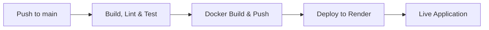

# 🚀 Flask CI/CD Pipeline with GitHub Actions, Docker & Render

[](https://github.com/DaviesBrown/flask-ci-cd-demo/actions)
[](https://codecov.io/gh/DaviesBrown/flask-ci-cd-demo)
[](https://ghcr.io/daviesbrown/flask-ci-cd-demo)
[](https://www.python.org/)
[](https://flake8.pycqa.org/)
[](https://flask-ci-cd-demo-cfz8.onrender.com)

> **A proof-of-concept modern CI/CD pipeline** showcasing automated testing, linting, Docker containerization, and continuous deployment using GitHub Actions and Render — all running **100% free**.

---

## 📋 Table of Contents

- [Overview](#-overview)
- [Tech Stack](#-tech-stack)
- [Pipeline Architecture](#%EF%B8%8F-pipeline-architecture)
- [Quick Start](#-quick-start)
- [Local Development](#-local-development)
- [Docker](#-docker)
- [CI/CD Workflow](#-cicd-workflow)
- [Deployment](#-deployment)
- [Configuration](#-configuration)
- [Project Structure](#-project-structure)
- [Contributing](#-contributing)
- [License](#-license)

---

## 🧠 Overview

This project demonstrates a **complete end-to-end CI/CD workflow** applied to a Flask web application. Built as a **DevOps portfolio piece**, it showcases:

- ✅ **Automated testing** with pytest and coverage reporting
- ✅ **Code quality enforcement** using flake8
- ✅ **Multi-version Python testing** (3.10, 3.11)
- ✅ **Containerization** with Docker
- ✅ **Automated image publishing** to GitHub Container Registry
- ✅ **Continuous deployment** to Render via webhook triggers
- ✅ **Production-ready** setup with Gunicorn

🔗 **[View Live Demo →](https://flask-ci-cd-demo-cfz8.onrender.com)**

---

## 🧩 Tech Stack

| Layer | Technology | Purpose |
|-------|------------|---------|
| **Language** | Python 3.10 / 3.11 | Application runtime |
| **Framework** | Flask | Lightweight web framework |
| **Testing** | pytest + pytest-cov | Unit testing & coverage |
| **Code Quality** | flake8 | Linting and style enforcement |
| **Coverage** | Codecov | Coverage reporting & tracking |
| **Server** | Gunicorn | Production WSGI server |
| **Containerization** | Docker | Application packaging |
| **Registry** | GitHub Container Registry | Docker image hosting |
| **CI/CD** | GitHub Actions | Automation pipeline |
| **Hosting** | Render | Production deployment |

---

## ⚙️ Pipeline Architecture



### 🔹 Stage 1: Build, Lint & Test
- **Triggers**: Push or PR to `main` branch
- **Matrix Strategy**: Tests across Python 3.10 & 3.11
- **Steps**:
  1. Checkout code
  2. Setup Python environment
  3. Install dependencies
  4. Run `flake8` linting
  5. Execute tests with `pytest` and generate coverage
  6. Upload coverage report to Codecov

### 🔹 Stage 2: Docker Build & Push
- **Prerequisites**: Successful test completion
- **Steps**:
  1. Checkout code
  2. Login to GitHub Container Registry
  3. Build Docker image with tag `ghcr.io/daviesbrown/flask-ci-cd-demo:latest`
  4. Push image to GHCR

### 🔹 Stage 3: Deploy to Render
- **Prerequisites**: Successful Docker build
- **Environment**: `production`
- **Trigger**: Webhook POST to Render Deploy Hook
- **Result**: Automatic redeployment of live application

---

## 🚀 Quick Start

```bash
# Clone the repository
git clone https://github.com/DaviesBrown/flask-ci-cd-demo.git
cd flask-ci-cd-demo

# Create virtual environment
python -m venv venv
source venv/bin/activate  # On Windows: venv\Scripts\activate

# Install dependencies
pip install -r requirements.txt

# Run the application
python app.py
```

🌐 Visit **http://localhost:5000**

---

## 🧪 Local Development

### Running Tests

```bash
# Run all tests
pytest -v

# Run with coverage report
pytest --cov --cov-branch --cov-report=html

# View coverage report
open htmlcov/index.html  # macOS
xdg-open htmlcov/index.html  # Linux
```

### Code Linting

```bash
# Run flake8
flake8 .

# Auto-fix some issues (requires autopep8)
autopep8 --in-place --aggressive --aggressive *.py
```

### Development Workflow

1. Create a feature branch
   ```bash
   git checkout -b feature/your-feature-name
   ```

2. Make changes and test locally
   ```bash
   pytest -v
   flake8 .
   ```

3. Commit and push
   ```bash
   git add .
   git commit -m "Add: your feature description"
   git push origin feature/your-feature-name
   ```

4. Create a Pull Request on GitHub
   - Automated checks will run
   - Merge after approval

---

## 🐳 Docker

### Build and Run Locally

```bash
# Build the image
docker build -t flask-ci-cd-demo:latest .

# Run the container
docker run -p 5000:5000 flask-ci-cd-demo:latest
```

### Pull from GitHub Container Registry

```bash
# Pull the image
docker pull ghcr.io/daviesbrown/flask-ci-cd-demo:latest

# Run the container
docker run -p 5000:5000 ghcr.io/daviesbrown/flask-ci-cd-demo:latest
```

### Docker Compose (Optional)

Create a `docker-compose.yml`:

```yaml
version: '3.8'
services:
  web:
    image: ghcr.io/daviesbrown/flask-ci-cd-demo:latest
    ports:
      - "5000:5000"
    environment:
      - FLASK_ENV=production
```

Run with:
```bash
docker-compose up
```

---

## 🔄 CI/CD Workflow

The complete GitHub Actions workflow is defined in `.github/workflows/ci.yml`:

### Workflow Visualization

```yaml
name: CI/CD Pipeline

on:
  push:
    branches: [main]
  pull_request:
    branches: [main]

jobs:
  build-test-lint:
    name: Build, Lint & Test
    runs-on: ubuntu-latest
    strategy:
      matrix:
        python-version: ["3.10", "3.11"]
    steps:
      - name: Checkout code
        uses: actions/checkout@v4
      
      - name: Set up Python
        uses: actions/setup-python@v5
        with:
          python-version: ${{ matrix.python-version }}
      
      - name: Install dependencies
        run: pip install -r requirements.txt
      
      - name: Run lint
        run: flake8 .
      
      - name: Install test dependencies
        run: pip install pytest pytest-cov
      
      - name: Run tests with coverage
        run: pytest --cov --cov-branch --cov-report=xml
      
      - name: Upload coverage to Codecov
        uses: codecov/codecov-action@v5
        with:
          token: ${{ secrets.CODECOV_TOKEN }}

  docker-build:
    name: Build & Push Docker Image
    runs-on: ubuntu-latest
    needs: build-test-lint
    steps:
      - name: Checkout code
        uses: actions/checkout@v4
      
      - name: Log in to GHCR
        uses: docker/login-action@v3
        with:
          registry: ghcr.io
          username: ${{ github.actor }}
          password: ${{ secrets.CR_PAT }}
      
      - name: Build and Push
        env:
          REPO_OWNER_LOWER: ${{ github.repository_owner }}
        run: |
          docker build -t ghcr.io/${REPO_OWNER_LOWER,,}/flask-ci-cd-demo:latest .
          docker push ghcr.io/${REPO_OWNER_LOWER,,}/flask-ci-cd-demo:latest

  deploy:
    name: Deploy to Render
    runs-on: ubuntu-latest
    needs: docker-build
    environment: production
    steps:
      - name: Trigger Render Deploy Hook
        run: curl -X POST "${{ secrets.RENDER_DEPLOY_HOOK }}"
```

---

## 🌍 Deployment

### Production Environment

The application is automatically deployed to **Render** on every successful build:

- **URL**: https://flask-ci-cd-demo-cfz8.onrender.com
- **Server**: Gunicorn WSGI
- **Runtime**: Python 3.11
- **Container**: Docker (from GHCR)

### Render Configuration

The `Procfile` defines the production command:

```
web: gunicorn app:app
```

### Manual Deployment

To manually trigger a deployment:

1. Go to your Render dashboard
2. Navigate to the service
3. Click "Manual Deploy" → "Deploy latest commit"

Or use the webhook:
```bash
curl -X POST "https://api.render.com/deploy/srv-xxxxx?key=xxxxx"
```

---

## 🔐 Configuration

### Required GitHub Secrets

| Secret Name | Description | How to Obtain |
|-------------|-------------|---------------|
| `CR_PAT` | GitHub Personal Access Token for GHCR | Settings → Developer settings → Personal access tokens → Generate with `write:packages` scope |
| `RENDER_DEPLOY_HOOK` | Render webhook URL for deployments | Render Dashboard → Service Settings → Deploy Hook |
| `CODECOV_TOKEN` | Codecov upload token | https://codecov.io → Repository Settings → Copy token |

### Setting Up Secrets

1. Go to your GitHub repository
2. Navigate to **Settings** → **Secrets and variables** → **Actions**
3. Click **New repository secret**
4. Add each secret with its corresponding value

### GitHub Actions Permissions

Ensure your workflow has proper permissions:

```yaml
permissions:
  contents: read
  packages: write
```

Or enable in **Settings** → **Actions** → **General** → **Workflow permissions** → Select "Read and write permissions"

---

## 📁 Project Structure

```
flask-ci-cd-demo/
├── .github/
│   └── workflows/
│       └── ci.yml              # CI/CD pipeline configuration
├── app.py                      # Flask application
├── test_app.py                 # Unit tests
├── requirements.txt            # Python dependencies
├── Procfile                    # Render/Heroku deployment config
├── Dockerfile                  # Container definition
├── .flake8                     # Flake8 linting configuration
├── .gitignore                  # Git ignore rules
└── README.md                   # This file
```

### Key Files

- **`app.py`**: Main Flask application with routes
- **`test_app.py`**: Pytest test suite
- **`Dockerfile`**: Multi-stage Docker build configuration
- **`requirements.txt`**: Production dependencies (Flask, Gunicorn)
- **`.github/workflows/ci.yml`**: Complete CI/CD pipeline definition

---

## 🤝 Contributing

Contributions are welcome! Here's how you can help:

### Reporting Issues

1. Check if the issue already exists
2. Create a new issue with:
   - Clear title and description
   - Steps to reproduce
   - Expected vs actual behavior
   - Environment details

### Submitting Changes

1. Fork the repository
2. Create a feature branch
   ```bash
   git checkout -b feature/amazing-feature
   ```
3. Make your changes
4. Run tests and linting
   ```bash
   pytest -v
   flake8 .
   ```
5. Commit with clear messages
   ```bash
   git commit -m "Add: amazing feature description"
   ```
6. Push to your fork
   ```bash
   git push origin feature/amazing-feature
   ```
7. Open a Pull Request

### Code Style

- Follow PEP 8 guidelines
- Write meaningful commit messages
- Add tests for new features
- Update documentation as needed

---

## 📊 Metrics & Monitoring

- **Build Status**: 
- **Code Coverage**: View on [Codecov](https://codecov.io/gh/DaviesBrown/flask-ci-cd-demo)
- **Container Size**: ~150MB (optimized multi-stage build)
- **Deploy Time**: ~2-3 minutes from push to live

---

## 🎯 Future Enhancements

- [ ] Add database integration (PostgreSQL)
- [ ] Implement API endpoints with Flask-RESTful
- [ ] Add Prometheus metrics endpoint
- [ ] Set up monitoring with Grafana
- [ ] Add health check endpoints
- [ ] Implement rate limiting
- [ ] Add authentication with JWT
- [ ] Create frontend with React
- [ ] Set up staging environment
- [ ] Add integration tests with Selenium

---

## 📚 Resources

- [Flask Documentation](https://flask.palletsprojects.com/)
- [GitHub Actions Documentation](https://docs.github.com/en/actions)
- [Docker Documentation](https://docs.docker.com/)
- [Render Documentation](https://render.com/docs)
- [pytest Documentation](https://docs.pytest.org/)

---

## 📄 License

This project is licensed under the MIT License - see the [LICENSE](LICENSE) file for details.

---

## 👨‍💻 Author

**Davies Brown**

- GitHub: [@DaviesBrown](https://github.com/DaviesBrown)
- LinkedIn: [Your LinkedIn](https://linkedin.com/in/yourprofile)
- Email: your.email@example.com

---

## ⭐ Show Your Support

If you find this project helpful, please consider giving it a ⭐️!

---

<div align="center">
  <sub>Built with ❤️ as a DevOps learning project</sub>
</div>
